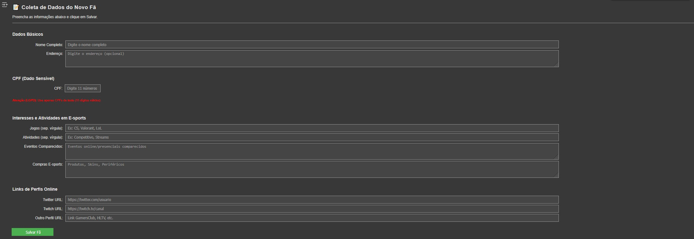
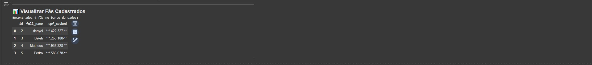
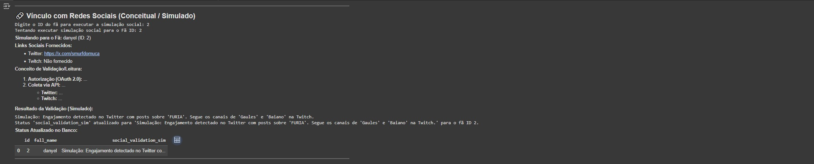
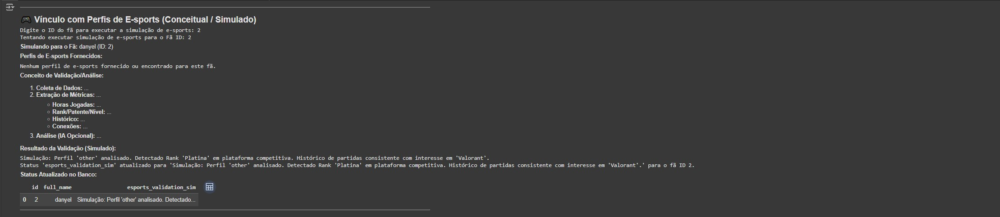

# Protótipo Know Your Fan (KYF) - E-sports

## Objetivo

Este notebook é um protótipo funcional que demonstra o conceito de uma solução "Know Your Fan" (KYF) focada em fãs de e-sports. O objetivo é mostrar o fluxo de coleta de dados, armazenamento e a *simulação conceitual* de processos de validação que poderiam ser usados para entender melhor e engajar os fãs.

## Tecnologias Utilizadas

* **Linguagem:** Python 3
* **Ambiente:** Google Colaboratory
* **Bibliotecas Principais:**
    * `sqlite3`: Para o banco de dados local simples.
    * `json`: Para armazenar dados semi-estruturados (listas, dicionários) em campos de texto.
    * `pandas`: Para exibição organizada de dados em tabelas.
    * `IPython.display`: Para renderizar Markdown e limpar output.
    * `re`: Para validações básicas (ex: formato CPF).

## Como Executar

1.  **Execute as Células de Setup (1, 2, 3):** Rode as três primeiras células de código em sequência para importar bibliotecas, inicializar o banco de dados (`kyf_database.db`) e definir as funções auxiliares.
    * **Importante:** Se você reiniciar o ambiente de execução do Colab, precisará rodar essas 3 células novamente.
2.  **Adicionar Fãs (Célula 5):** Execute a célula "📝 Coleta de Dados do Novo Fã". Siga as instruções interativas (inputs) para adicionar um ou mais fãs. Lembre-se da sensibilidade do CPF (use dados de teste).
3.  **Visualizar Resumo (Célula 6):** Execute a célula "📊 Visualizar Fãs Cadastrados" para ver uma lista de todos os fãs no banco.
4.  **Executar Simulações (Células 7 e 8):** Execute as células "🔗 Vínculo com Redes Sociais" e "🎮 Vínculo com Perfis de E-sports". Elas usarão um `target_fan_id` (atualmente ID 2) para buscar dados, explicar conceitos, mostrar resultados simulados e atualizar o status simulado no banco para aquele fã específico.

## Estrutura do Notebook

* **Células 1-3:** Configuração Inicial (Imports, DB Init, Funções Auxiliares).
* **Célula 4:** Título e Introdução Breve (Pode ser removida ou mesclada com esta).
* **Célula 5:** Coleta Interativa de Dados de um Novo Fã.
* **Célula 6:** Visualização de Resumo de Todos os Fãs.
* **Célula 7:** Simulação e Conceito - Vínculo Social.
* **Célula 8:** Simulação e Conceito - Vínculo Perfis E-sports.

   **Célula 5:** Coleta Interativa de Dados de um Novo Fã (usando `ipywidgets`).
  *Interface:*
    *
  **Célula 6:** Visualização de Resumo de Todos os Fãs.
  *Exemplo:*
   *
  **Célula 7:** Simulação e Conceito - Vínculo Social.
  *Exemplo de Saída:*
   *
  **Célula 8:** Simulação e Conceito - Vínculo Perfis E-sports.
  *Exemplo de Saída:*
   *
  **Célula 9:** Visualizar Perfil Completo de um Fã.
  *Exemplo de Saída:*
  

## Funcional vs. Simulado

* **Funcional:**
    * Coleta de dados via input.
    * Processamento básico (mascaramento de CPF, formatação JSON).
    * Armazenamento e recuperação de dados no banco SQLite.
    * Visualização de dados via Pandas.
* **Simulado / Conceitual:**
    * **Vínculo Social:** A conexão real via OAuth e leitura de APIs NÃO é feita. A célula *descreve* como seria, exibe os links fornecidos e gera um *texto simulado* do resultado da validação, atualizando o campo `social_validation_sim` no banco.
    * **Vínculo Perfis E-sports:** A análise real via API/Scraping NÃO é feita. A célula *descreve* como seria, exibe os links fornecidos e gera um *texto simulado* do resultado da validação, atualizando o campo `esports_validation_sim` no banco.

## Privacidade (LGPD)

Este protótipo lida com dados fictícios ou de teste. Em uma aplicação real:
* O CPF só deve ser coletado com base legal clara e armazenado de forma segura (criptografado). A exibição deve ser sempre mascarada.
* O consentimento do usuário é essencial para coleta e processamento, especialmente para acesso a dados de terceiros (APIs sociais).
* Princípios de minimização de dados e transparência devem ser seguidos.
